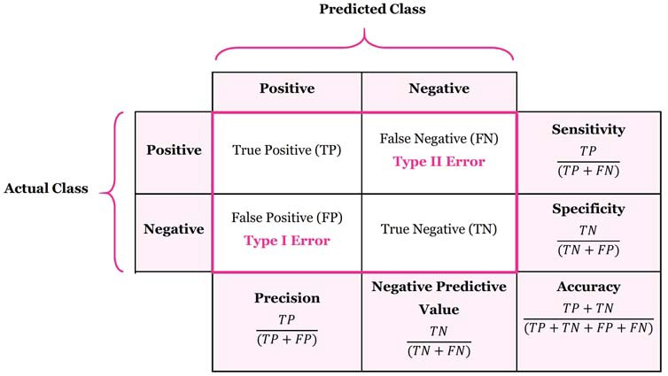

<style type="text/css">
h1.title {
  font-size: 50px;
}
</style>

```{r setup, include=FALSE}
knitr::opts_chunk$set(echo = TRUE)
```

<p align="center">
  
</p>

## 1. Preface

### 1.1 Background

Mushroom hunting (otherwise known as "shrooming") is a common thing to do in order to get local food sources. Of the many different species - specifically found in North America, nearly all mushrooms are technically edible, although many are too fibrous to eat. Only about 250 of them are considered significantly poisonous.

However, eating mushrooms directly collected from wild without proper identification could be fatal. They can sometimes provide secondary metabolites that are harmful and toxic, sometimes mind-altering, antibiotics, and antivirals to human lives. What's more, some edible and poisonous mushrooms look almost exactly the same. So, those become the reasons why learning to identify poisonous mushrooms based on their characteristics are so important.

In this project, we will discover which features that most indicate a mushroom is poisonous. By comparing three machine learning methods (Naive Bayes Classifier, Decision Tree, Random Forest), we will create a predictive model that can identify poisonous mushrooms precisely.

### 1.2 About the Dataset

The dataset used in this project is taken from [kaggle](https://www.kaggle.com/datasets/uciml/mushroom-classification). The dataset was originally contributed to the UCI Machine Learning repository about 30 years ago. The dataset includes attributes of samples corresponding to 23 species of gilled mushrooms in the Agaricus and Lepiota family drawn from The Audubon Society Field Guide to North American Mushrooms (1981). Each species is identified as an edible and poisonous. 

<br>
```{r, echo=FALSE, out.width='40%', fig.align='center', fig.cap="Mushroom Anatomy"}

```

**Attribute Information:** (`class`: edible = e, poisonous = p)

- `cap.shape`: bell = b, conical = c, convex = x, flat = f, knobbed = k, sunken = s
- `cap.surface`: fibrous = f, grooves = g, scaly = y, smooth = s
- `cap.color`: brown = n, buff = b, cinnamon = c, gray = g, green = r, pink = p, purple = u, red = e, white = w, yellow = y
- `bruises`: bruises = t, no = f
- `odor`: almond = a, anise = l, creosote = c, fishy = y, foul = f, musty = m, none = n, pungent = p, spicy = s
- `gill.attachment`: attached = a, descending = d, free = f, notched = n
- `gill.spacing`: close = c, crowded = w, distant = d
- `gill.size`: broad = b, narrow = n
- `gill.color`: black = k, brown = n, buff = b, chocolate = h, gray = g, green = r, orange = o, pink = p, purple = u, red = e, white = w, yellow = y
- `stalk.shape`: enlarging = e, tapering = t
- `stalk.root`: bulbous = b, club = c, cup = u, equal = e, rhizomorphs = z, rooted = r, missing = ?
- `stalk.surface.above.ring`: fibrous = f, scaly = y, silky = k, smooth = s
- `stalk.surface.below.ring`: fibrous = f, scaly = y, silky = k, smooth = s
- `stalk.color.above.ring`: brown = n, buff = b, cinnamon = c, gray = g, orange = o, pink = p, red = e, white = w, yellow = y
- `stalk.color.below.ring`: brown = n, buff = b, cinnamon = c, gray = g, orange = o, pink = p, red = e, white = w, yellow = y
- `veil.type`: partial = p, universal = u
- `veil.color`: brown = n, orange = o, white = w, yellow = y
- `ring.number`: none = n, one = o, two = t
- `ring.type`: cobwebby = c, evanescent = e, flaring = f, large = l, none = n, pendant = p, sheathing = s, zone = z
- `spore.print.color`: black = k, brown = n, buff = b, chocolate = h, green = r, orange = o, purple = u, white = w, yellow = y
- `population`: abundant = a, clustered = c, numerous = n, scattered = s, several = v, solitary = y
- `habitat`: grasses = g, leaves = l, meadows = m, paths = p, urban = u, waste = w, woods = d

## 2. Dependencies

Load the required libraries.

```{r message=FALSE, warning=FALSE}
# load library
library(dplyr) # for data transformation
library(ggplot2) # to make visualizations
library(kableExtra) # to make table in markdown
library(gridExtra) # to make layout for multiple charts
library(reshape2) # to transform data between wide and long formats
library(greybox) # to calculate cramer's v
library(rsample) # for train-test splitting
library(e1071) # to build classication using nbc
library(caret) # to make confusion matrix and calculate metrics
library(partykit) # to build classication using dt
library(randomForest) # to build classication using rf
```

## 3. Read Data

Read the dataset that will be used.

```{r}
# read data
mushroom <- read.csv("data_input/mushrooms.csv", header = T, na.strings = c(""), stringsAsFactors = TRUE)
```

```{r warning=FALSE, echo=FALSE}
mushroom %>% 
  kable(row.names = 1:nrow(mushroom)) %>%
  kable_paper() %>%
  row_spec(0, background = "#5FD5DE") %>% 
  kable_styling(bootstrap_options = c("striped", "hover", "condensed", "responsive", full_width = F, position = "center")) %>% 
  scroll_box(width = "775px", height = "400px")  
```
<br>

## 4. Data Wrangling and Exploratory Data Analysis

First, the data structure must be checked - whether the data types are correct or not.

```{r}
# check data structure
str(mushroom)
```

It can be seen that the data types are already correct on all variables as I had used **stringsAsFactors = TRUE** when reading the data. 

And the next step is to check for missing values and imbalanced class.

```{r}
# check imbalanced class
prop.table(table(mushroom$class))
```

Our target class is not imbalanced.

```{r}
# check missing value
colSums(is.na(mushroom))
```

Also there is no missing value.

Because everything is still in line, next, the analysis can be continued by looking at the distribution of the target class for each predictor's level. This is carried out in order to explore the effect of each predictor's level on the target variable. Here, I use proportional bar chart.

<br>
```{r echo=FALSE, fig.align="center"}
cbPalette <- c("#3AE120","#FA9541")

a <- ggplot(data.frame(prop.table(table(cap.shape = mushroom$cap.shape, class = mushroom$class), margin =1)),
       aes(fill = class, y = Freq, x = cap.shape)) + 
  geom_bar(position = "stack", stat = "identity") +
  labs(y = "proportion") +
  scale_fill_manual(values = cbPalette)

b <- ggplot(data.frame(prop.table(table(cap.surface = mushroom$cap.surface, class = mushroom$class), margin =1)),
       aes(fill = class, y = Freq, x = cap.surface)) + 
  geom_bar(position = "stack", stat = "identity") +
  labs(y = "proportion") +
  scale_fill_manual(values = cbPalette)

c <- ggplot(data.frame(prop.table(table(cap.color = mushroom$cap.color, class = mushroom$class), margin =1)),
       aes(fill = class, y = Freq, x = cap.color)) + 
  geom_bar(position = "stack", stat = "identity") +
  labs(y = "proportion") +
  scale_fill_manual(values = cbPalette)

d <- ggplot(data.frame(prop.table(table(bruises = mushroom$bruises, class = mushroom$class), margin =1)),
       aes(fill = class, y = Freq, x = bruises)) + 
  geom_bar(position = "stack", stat = "identity") +
  labs(y = "proportion") +
  scale_fill_manual(values = cbPalette)

e <- ggplot(data.frame(prop.table(table(odor = mushroom$odor, class = mushroom$class), margin =1)),
       aes(fill = class, y = Freq, x = odor)) + 
  geom_bar(position = "stack", stat = "identity") +
  labs(y = "proportion") +
  scale_fill_manual(values = cbPalette)

f <- ggplot(data.frame(prop.table(table(gill.attachment = mushroom$gill.attachment, class = mushroom$class), margin =1)),
       aes(fill = class, y = Freq, x = gill.attachment)) + 
  geom_bar(position = "stack", stat = "identity") +
  labs(y = "proportion") +
  scale_fill_manual(values = cbPalette)

g <- ggplot(data.frame(prop.table(table(gill.spacing = mushroom$gill.spacing, class = mushroom$class), margin =1)),
       aes(fill = class, y = Freq, x = gill.spacing)) + 
  geom_bar(position = "stack", stat = "identity") +
  labs(y = "proportion") +
  scale_fill_manual(values = cbPalette)

h <- ggplot(data.frame(prop.table(table(gill.size = mushroom$gill.size, class = mushroom$class), margin =1)),
       aes(fill = class, y = Freq, x = gill.size)) + 
  geom_bar(position = "stack", stat = "identity") +
  labs(y = "proportion") +
  scale_fill_manual(values = cbPalette)

i <- ggplot(data.frame(prop.table(table(gill.color = mushroom$gill.color, class = mushroom$class), margin =1)),
       aes(fill = class, y = Freq, x = gill.color)) + 
  geom_bar(position = "stack", stat = "identity") +
  labs(y = "proportion") +
  scale_fill_manual(values = cbPalette)

grid.arrange(a, b, c, d, e, f, g, h, i, nrow = 3, ncol = 3)
```
```{r echo=FALSE, fig.align="center"}
j <- ggplot(data.frame(prop.table(table(stalk.shape = mushroom$stalk.shape, class = mushroom$class), margin =1)),
       aes(fill = class, y = Freq, x = stalk.shape)) + 
  geom_bar(position = "stack", stat = "identity") +
  labs(y = "proportion") +
  scale_fill_manual(values = cbPalette)

k <- ggplot(data.frame(prop.table(table(stalk.root = mushroom$stalk.root, class = mushroom$class), margin =1)),
       aes(fill = class, y = Freq, x = stalk.root)) + 
  geom_bar(position = "stack", stat = "identity") +
  labs(y = "proportion") +
  scale_fill_manual(values = cbPalette)

l <- ggplot(data.frame(prop.table(table(stalk.surface.above.ring = mushroom$stalk.surface.above.ring, class = mushroom$class), margin =1)),
       aes(fill = class, y = Freq, x = stalk.surface.above.ring)) + 
  geom_bar(position = "stack", stat = "identity") +
  labs(y = "proportion") +
  scale_fill_manual(values = cbPalette)

m <- ggplot(data.frame(prop.table(table(stalk.surface.below.ring = mushroom$stalk.surface.below.ring, class = mushroom$class), margin =1)),
       aes(fill = class, y = Freq, x = stalk.surface.below.ring)) + 
  geom_bar(position = "stack", stat = "identity") +
  labs(y = "proportion") +
  scale_fill_manual(values = cbPalette)

n <- ggplot(data.frame(prop.table(table(stalk.color.above.ring = mushroom$stalk.color.above.ring, class = mushroom$class), margin =1)),
       aes(fill = class, y = Freq, x = stalk.color.above.ring)) + 
  geom_bar(position = "stack", stat = "identity") +
  labs(y = "proportion") +
  scale_fill_manual(values = cbPalette)

o <- ggplot(data.frame(prop.table(table(stalk.color.below.ring = mushroom$stalk.color.below.ring, class = mushroom$class), margin =1)),
       aes(fill = class, y = Freq, x = stalk.color.below.ring)) + 
  geom_bar(position = "stack", stat = "identity") +
  labs(y = "proportion") +
  scale_fill_manual(values = cbPalette)

p <- ggplot(data.frame(prop.table(table(veil.type = mushroom$veil.type, class = mushroom$class), margin =1)),
       aes(fill = class, y = Freq, x = veil.type)) + 
  geom_bar(position = "stack", stat = "identity") +
  labs(y = "proportion") +
  scale_fill_manual(values = cbPalette)

q <- ggplot(data.frame(prop.table(table(veil.color = mushroom$veil.color, class = mushroom$class), margin =1)),
       aes(fill = class, y = Freq, x = veil.color)) + 
  geom_bar(position = "stack", stat = "identity") +
  labs(y = "proportion") +
  scale_fill_manual(values = cbPalette)

r <- ggplot(data.frame(prop.table(table(ring.number = mushroom$ring.number, class = mushroom$class), margin =1)),
       aes(fill = class, y = Freq, x = ring.number)) + 
  geom_bar(position = "stack", stat = "identity") +
  labs(y = "proportion") +
  scale_fill_manual(values = cbPalette)

grid.arrange(j, k, l, m, n, o, p, q, r, nrow = 3, ncol = 3)
```
```{r echo=FALSE, fig.align="center", out.width="50%"}
s <- ggplot(data.frame(prop.table(table(ring.type = mushroom$ring.type, class = mushroom$class), margin =1)),
       aes(fill = class, y = Freq, x = ring.type)) + 
  geom_bar(position = "stack", stat = "identity") +
  labs(y = "proportion") +
  scale_fill_manual(values = cbPalette)

t <- ggplot(data.frame(prop.table(table(spore.print.color = mushroom$spore.print.color, class = mushroom$class), margin =1)),
       aes(fill = class, y = Freq, x = spore.print.color)) + 
  geom_bar(position = "stack", stat = "identity") +
  labs(y = "proportion") +
  scale_fill_manual(values = cbPalette)

u <- ggplot(data.frame(prop.table(table(population = mushroom$population, class = mushroom$class), margin =1)),
       aes(fill = class, y = Freq, x = population)) + 
  geom_bar(position = "stack", stat = "identity") +
  labs(y = "proportion") +
  scale_fill_manual(values = cbPalette)

v <- ggplot(data.frame(prop.table(table(habitat = mushroom$habitat, class = mushroom$class), margin =1)),
       aes(fill = class, y = Freq, x = habitat)) + 
  geom_bar(position = "stack", stat = "identity") +
  labs(y = "proportion") +
  scale_fill_manual(values = cbPalette)

grid.arrange(s, t, u, v, nrow = 2, ncol = 2)
```


Correlations between variables also need to be seen. I use Cramer's V to describe how close the relationship between two predictor variables is.

```{r include=FALSE, message=FALSE, warning=FALSE}
mushroom <- mushroom %>% 
  select(-veil.type)

df <- data.frame(column1 = numeric(0), column2 = numeric(0), cram = numeric(0))
n <- ncol(mushroom)

for(col in 1:n)
{
  col1 <- 1
  while(col1<=n)
  {
    a <- cramer(mushroom[,col],mushroom[,col1])
    column1 <- names(mushroom)[col]
    column2 <- names(mushroom)[col1]
    df[nrow(df)+1,] <- c(column1, column2, a)
    col1 <- col1 + 1
  }
}
```


```{r include=FALSE}
df1 <- xtabs(formula = cram ~ column1 + column2, data = df)

get_lower_tri<- function(df1){
    df1[lower.tri(df1)] <- NA
    return(df1)
}

lower_tri <- get_lower_tri(df1)

melted_cormat <- melt(lower_tri, na.rm = TRUE)
```


```{r results='hide', echo=FALSE, fig.keep='all', fig.cap="Correlation Between Variables", fig.align="center"}
ggplot(data = melted_cormat, aes(column2, column1, fill = value)) +
 geom_tile(color = "white") +
 scale_fill_gradient2(low = "blue", high = "red", mid = "white", 
   midpoint = 0.5, limit = c(0,1), space = "Lab", 
   name="Cramer's V") +
  theme_minimal() + 
 theme(axis.text.x = element_text(angle = 90, vjust = 0.3, 
    size = 9, hjust = 1)) +
  labs(x = "", y = "")
```


Based on the proportional bar charts and correlation heatmap, I can take some conclusions:

- `veil.type` has only 1 level. So, it can be considered as constant. As we know, constant variable always has no effect on the target, `veil.type` can be removed from the predictor list.
- According to correlation heatmap, `stalk.shape` has weak correlation with target variable. This can also be seen in the proportional bar chart, where all levels of `stalk.shape` have almost-balanced distribution of target classes. Because of its weak correlation, I decided to remove `stalk.shape` from the predictor list.
- In naive bayes classifier, there is an assumption that the predictor variables must be independent of each other. However, based on the heatmap correlation, it appears that many predictor variables have a strong relationship. This will certainly interfere the performance of naive bayes classifier. But for this time, I decided to delete `gill.attachment` and `veil.color` only (specifically when modeling with naive bayes classifier) because they have strong correlation with other predictors, as well as they have weak correlation with the target variable.
- In accordance with proportional bar charts, it can be seen that some variables are perfect separators, hence, laplace smoothing must be applied. 

With conclusions above, feature selection will be carried out as follows.

```{r}
# feature selection
# veil.type already removed from dataset
mushroom <- mushroom %>% 
  select(-c(stalk.shape))
```

```{r}
# feature selection dedicated to nbc
mushroom_nbc <- mushroom %>% 
  select(-c(gill.attachment, veil.color))
```

At this point, data wrangling and EDA have been completed.

## 5. Train-Test Splitting

The train-test split procedure is used to estimate the performance of machine learning algorithms in making predictions, especially on new data.

In this project, I divide the dataset into a set with with 80:20 proportion.

```{r warning=FALSE}
# train-test splitting
RNGkind(sample.kind = "Rounding")
set.seed(100)

index <- sample(x = nrow(mushroom), size= nrow(mushroom)*0.8)
mushroom_train <- mushroom[index,]
mushroom_test <- mushroom[-index,]
```

```{r warning = FALSE}
# train-test splitting
RNGkind(sample.kind = "Rounding")
set.seed(100)

ind <- sample(x = nrow(mushroom_nbc), size= nrow(mushroom_nbc)*0.8)
mushroom_train_nbc <- mushroom_nbc[ind,]
mushroom_test_nbc <- mushroom_nbc[-ind,]
```

## 6. Modeling

### 6.1 Performance Metric

<br>
```{r, echo=FALSE, out.width='65%', fig.align='center', fig.cap="Confusion Matrix and Performance Metrics"}

```

Before doing the modeling, the performance metric must be decided first. For this case, when poisonous mushroom was predicted as edible mushroom, it will be very dangerous and misleading as people can get sick/die if they truly eat it. So, to overcome that, we need a predictive model that can reduce **false negative** (the number of poisonous mushrooms falsely predicted as edible mushrooms). 

From the metrics' formulas, it seems that **recall** - also known as **sensitivity** - is the most suitable metric when our goal is to minimize false negative. 

### 6.2 Modeling with Naive Bayes Classifier

Based on the EDA that had been conducted before, it is known that our mushroom dataset is actually not very appropriate for naive bayes classifier - many predictors have high correlation with each other (there is multicollinearity). Even so, I am still going to try using naive bayes and compare the performance with other methods. Besides, as our dataset has many variables that are perfect separators, the **laplace = 1** will also be included.

```{r}
# model building using nbc
naive <- naiveBayes(formula = class ~ . , 
                    data = mushroom_train_nbc, 
                    laplace = 1)

naive
```
```{r}
# predict using nbc model
naive_pred <- predict(naive, newdata = mushroom_test_nbc, type = "class") # class prediction
naive_prob <- predict(naive, newdata = mushroom_test_nbc, type = "raw") # probability prediction

# evaluate nbc model using confusionmatrix
naive_cm <- confusionMatrix(data = naive_pred, 
                reference = mushroom_test_nbc$class,
                positive = "p") 

naive_cm
```
The recall value is 90.49%. In my opinion, this value is good enough. But you can make improvements by tuning the model, perhaps by selecting features (so that there is no multicollinearity) or changing the threshold in determining class label, or maybe another ways. 

But, in this project, I didn't tune my model because I was already satisfied with the result.

### 6.3 Modeling with Decision Tree

Tree-based models are powerful models and most popular choice for machine learning tasks. In tree-based models, multicollinearity will not be a problem. This becomes an advantage when modeling the mushroom dataset because this dataset has multicollinearity.

Decision tree is one of the tree-based models which has the major benefit of being interpretable. Decision tree is an algorithm that will make a set of rules visualized in a diagram that resembles a tree.

In this project, I use `partykit` library to fit the decision tree model.

```{r}
# model building using dt
dt <- ctree(formula = class ~ .,
            data = mushroom_train)
dt
```
```{r eval=FALSE, include=FALSE}
jpeg("assets/plot_dt.jpg", width=1000, height=750)
plot(dt, type ="simple") 
dev.off()
```

<br>
```{r, echo=FALSE, out.width='60%', fig.align='center', fig.cap="Decision Tree"}

```

From the tree above, we can interpret the model as following:

- If the mushroom has an odor of c (creosote), f (foul), m (musty), p (pungent) , s (spicy), y (fishy), then the mushroom will have a poisonous status of 3029 mushrooms with an error of 0%
- If the mushroom has an odor of a (almond), l (anise), n (none) and its spore print color is r (green), then the mushroom will have a poisonous status of 57 mushrooms with an error of 0%
- etc.

```{r}
# predict using dt model
dt_pred <- predict(dt, newdata = mushroom_test, type = "response") # class prediction
dt_prob <- predict(dt, newdata = mushroom_test, type = "prob") # probability prediction

# evaluate dt model using confusionmatrix
dt_cm <- confusionMatrix(data = dt_pred, 
                reference = mushroom_test$class,
                positive = "p") 

dt_cm
```
Whoa, it turns out that the recall is very high, which is 100%. This shows that the decision tree model can predict accurately.

In this case, I didn't tune my model because I thought the tree is already simple. However, if you want to make your tree simpler, you can do pre-pruning/post-pruning.

#### ✍ Additional: Pre-Pruning

Install parameters before model is generated. This method is not recommended because we don't have any information about what parameters we should set (have to guess/using `gridsearchcv`).

Pruning Parameters:

- mincriterion: Value 1 - $\alpha$. When mincriterion is 0.95, the p-value must be < 0.05 for a node to be able to branch. (default: 0.95)
- minsplit: Minimum number of observations that must exist in a node in order for a split to be attempted. (default: 20)
- minbucket: Minimum number of observations on the terminal node. (default: 7)

#### ✍ Additional: Post-Pruning

Pruning after getting a complete/complex model and determines how far the trimming will be.

### 6.4 Modeling with Random Forest

One way to suppress *bias and variance* is to combine predictions from several models into a single prediction. The combination of several machine learning models is called **Ensemble Method**. The ensemble method aims to improve prediction performance of the model. One example of ensemble method - which is also the development of a decision tree - is **Random Forest**.

Random forest makes prediction by creating many decision trees, where each decision tree has its own characteristics and is not related to each other. 

**The process**: Random forest makes predictions for each decision tree, and then voting will be done based on those predictions. With voting, the class with the most number will be the final prediction result.

One of disadvantages of random forest is the computational load (very large). However, this shortcoming can be overcome easily by selecting predictors. We can remove some columns which have near-zero variance (less informative) with `nearZeroVar()`.

```{r}
# variable with near-zero variance
no_var <- nearZeroVar(mushroom_train)
mushroom_train[,no_var]
```
```{r}
# variable with near-zero variance
novar <- nearZeroVar(mushroom_test)
mushroom_test[,novar]
```

It turns out that the variables which have near-zero variances are the ones we also removed when modeling using the naive bayes classifier (which are `gill.attachment` and `veil.color`).

```{r}
# remove column with near-zero variance
mushroom_train <- mushroom_train[,-no_var]
mushroom_test <- mushroom_test[,-novar]
```

After that, the model can be built safely. 

```{r eval=FALSE}
# model building using rf
set.seed(417)
ctrl <- trainControl(method = "repeatedcv", number = 5, repeats = 3) # k-fold cross validation

rf_model <- train(class ~ ., 
                  data = mushroom_train, 
                  method = "rf",
                  trControl = ctrl)
   
# save model
saveRDS(rf_model, "model/rf_mushroom.RDS")
```

```{r}
# read model
rf_readmodel <- readRDS("model/rf_mushroom.RDS")

# summary of model
rf_readmodel
```
From the summary, the optimum number of variables which will be considered in node splitting is 46 variables. 

The importance of each variable can also be inspected using `varImp()`.

```{r message=FALSE, warning=FALSE}
# variable importance
varImp(rf_readmodel)
```

Actually, when using random forest, we are not required to split our dataset into training and testing sets because random forest already has **out-of-bag estimates (OOB)** - which act as a reliable estimate of the error (1-accuracy) of unseen samples. Although, it is also possible to hold out a regular train-test splitting (as we done in this project).

```{r}
# summary of final model
rf_readmodel$finalModel
```
In the `rf_readmodel` model, the value of out-of-bag error is 0%. In other words, the accuracy of model on out of bag data is 100%.

However, we can also test our model to our testing set as follows.

```{r}
# prediction on test set
rf_pred <- predict(rf_readmodel, newdata = mushroom_test)

# evaluate rf model using confusionmatrix
rf_cm <- confusionMatrix(rf_pred, reference = mushroom_test$class, positive = "p")

rf_cm
```
It turns out that the random forest model also produces a high recall value and is an accurate predictive model.

## 7. Conclusion

```{r echo=FALSE}
Method <- c("Naive Bayes Classifier", "Decision Tree", "Random Forest")
Accuracy <- c(0.9508*100, 1*100, 1*100)
Recall <- c(0.9049*100, 1*100, 1*100)
Precision <- c(0.9930*100, 1*100, 1*100)
evaluation <- data.frame(Method, Accuracy, Recall, Precision, row.names = 1:3)
names(evaluation)[2] <- "Accuracy (%)"
names(evaluation)[3] <- "Recall (%)"
names(evaluation)[4] <- "Precision (%)"
```
```{r warning=FALSE, echo=FALSE}
evaluation %>% 
  kable(row.names = 1:nrow(mushroom)) %>%
  kable_paper() %>%
  row_spec(0, background = "#5FD5DE") %>% 
  kable_styling(bootstrap_options = c("striped", "hover", "condensed", "responsive", full_width = F, position = "center")) %>% 
  scroll_box(width = "775px", height = "200px")  
```
<br>
Based on the table above, Decision Tree and Random Forest algorithms gave the best result. They both gave highest sensitivity (recall), precision (pos pred value), and accuracy - all of which are rated at 100%. Therefore, the best models to predict poisonous mushroom based on its characteristics are **Random Forest** and **Decision Tree**.

